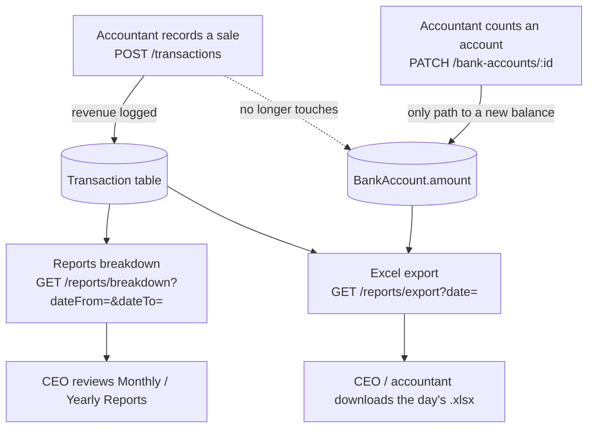

# Accounting Flow Changes — Balances, Reports, Export

**Status:** shipped and verified end-to-end against a real seeded workspace over real HTTP (not mocked, not raw SQL). See [Verification](#verification) for the actual run.
**Related docs:** `docs/accounting-reports-spec.md` (the gap analysis this work closes), `docs/accounting-workspace-migration-changes.md` (dated Follow-up entries with full technical detail per change).

---

## 1. Why this changed

The accountant used to record a sale and have it silently push a bank account's stored balance up or down. In practice, balances need to reflect what the accountant actually counted in the account — not a running total of sales that might be edited or deleted later. So the two were split apart:

- **Recording a sale** is now purely a revenue record.
- **A bank account's balance** changes only when the accountant deliberately sets it.

Separately, the Reports section (daily/monthly/yearly, and a one-click Excel export) didn't exist in a form that could answer "what happened during a specific period" — every breakdown on the Overview screen was all-time only. This work builds that out.

---

## 2. The flow, end to end



The dotted line is the point of the whole change: **sales and balances no longer talk to each other automatically.**

---

## 3. What changed, in order

### 3.1 Transactions no longer move balances

`transaction.service.ts` — `create()`, `update()`, `remove()` each used to also write to `BankAccount.amount` (increment on create, reverse-then-reapply on update, reverse on delete). All of that is gone. Each method now does exactly one write: the `Transaction` row itself.

`bankAccountId` is still required on every transaction and still validated against the account's currency — it's just a label now ("this sale came in through Whop"), not a balance instruction.

**The only remaining way a balance changes:** `PATCH /bank-accounts/:id`, unchanged, already existed before this work.

### 3.2 Reports can now be scoped to a period

Three of the aggregations behind the Overview screen — revenue by bank account, revenue by currency, and top clients — used to only ever answer "all-time." A new endpoint layers a date-scoped version of the same math on top, without changing Overview's behavior at all:

```
GET /accounting-dashboard/reports/breakdown?dateFrom=YYYY-MM-DD&dateTo=YYYY-MM-DD
```

Pass the same date twice for a single day, a full month for Monthly Reports, a full year for Yearly Reports — one endpoint, three screens. Capped at 400 days per request so it can't be used to scan a workspace's whole history in one call.

Top clients are ranked here by actual summed transaction revenue in the period — not by the `Clients.totalRevenue` field Overview's version uses (that field is hand-entered and known to drift from real activity; left untouched here on purpose, see `accounting-reports-spec.md` §4.2).

### 3.3 One-click Excel export

```
GET /accounting-dashboard/reports/export?date=YYYY-MM-DD
```

`date` is optional — omit it and you get today (UTC). Returns a real `.xlsx` file, not JSON, with four sheets:

| Sheet | What's in it |
|---|---|
| Transactions | Every sale that day — ref ID, date, client, bank account, currency, amount, description |
| Sales Summary | Total revenue (USD), sales count, average sale |
| Balances by Account | Every account's **current** balance — explicitly labeled current, since there's no historical ledger to answer "what was the balance on that day" |
| Revenue Breakdown | Two tables: revenue by currency, and revenue by bank account, both scoped to the exported day |

---

## 4. Verification

This wasn't just unit-tested — it was run against a real seeded workspace, over real HTTP, with a real login, and the actual `.xlsx` was downloaded and parsed back to confirm its contents.

**Seed:** a dedicated demo workspace ("Demo — Accounting Flow"), 3 bank accounts (Whop/USD, Slash/USD, HBL/PKR), 3 clients, and 15 transactions spread across today, earlier this month, and last month.

**Balance decoupling, proven live:**

```
GET /bank-accounts  →  Whop 18,400.00 USD · Slash 7,200.00 USD · HBL 1,250,000.00 PKR
```

Exactly the seeded starting balances — after 15 transactions were created through the real `POST /transactions` endpoint. Nothing moved them.

**Reports breakdown, three different windows, three different (correct) answers:**

| Window | Whop (USD) | Slash (USD) | HBL (PKR → USD) |
|---|---|---|---|
| All-time (`/overview`, unaffected by this change) | 9,750 · 6 sales | 9,500 · 5 sales | 237,000 → 852.52 · 4 sales |
| This month (`/reports/breakdown`) | 6,250 · 4 sales | 5,550 · 3 sales | 120,000 → 431.65 · 2 sales |
| Today only (`/reports/breakdown`) | 1,200 · 1 sale | 850 · 1 sale | 42,000 → 151.08 · 1 sale |

Same three accounts, three genuinely different numbers depending on the window — confirming the new `range` parameter actually scopes the query rather than silently returning all-time data.

**Excel export, downloaded and parsed back:**

`GET /reports/export?date=2026-08-18` returned a 9,572-byte file, `Content-Type: application/vnd.openxmlformats-officedocument.spreadsheetml.sheet`, confirmed as a genuine "Microsoft Excel 2007+" file. Reading it back:

```
Transactions:        DEMO-0001 Victoria Partners · Whop · USD 1200
                      DEMO-0002 Anton Enne · Slash · USD 850
                      DEMO-0003 Phase Shop · HBL · PKR 42000
Sales Summary:        2026-08-18 · $2,201.08 total · 3 sales · $733.69 avg
Balances by Account:  HBL 1,250,000 PKR ($4,496.40) · Whop $18,400 · Slash $7,200
Revenue Breakdown:    USD $2,050 (93.14%) · PKR 42,000 ($151.08, 6.86%)
                      Whop $1,200 · Slash $850 · HBL 42,000 PKR ($151.08)
```

Every figure in the file matches what the JSON endpoints returned for the same day and workspace.

**Static checks:** `tsc --noEmit`, `eslint`, `nest build` all clean throughout.

---

## 5. Where this lives in code

| Piece | File |
|---|---|
| Balance decoupling | `apps/api/src/transactions/transaction.service.ts` |
| Reports breakdown + export data gathering | `apps/api/src/accounting-dashboard/accounting-dashboard.service.ts` (`getReportsBreakdown`, `getDailyExportData`, `getTopClientsByRevenue`, `utcDayRange`) |
| Reports + export routes | `apps/api/src/accounting-dashboard/accounting-dashboard.controller.ts` |
| Excel rendering | `apps/api/src/accounting-dashboard/report-export.service.ts` |
| New query/response DTOs | `apps/api/src/accounting-dashboard/dto/reports-breakdown-*.dto.ts`, `dto/export-report-query.dto.ts` |

All four new/changed endpoints stay behind the same guard chain as the rest of this module: `JwtAuthGuard` + `WorkspaceGuard` + `AccountingRoleGuard`, requiring the `x-workspace-id` header and a CEO or ACCOUNTANT accounting role.

## 6. Not done in this change (open, on purpose)

- **No historical balance snapshots.** Every "balance" shown anywhere is current, never as-of-a-past-date — there's no ledger table to make that truthful yet. Flagged as an open product decision in `accounting-reports-spec.md` §5.
- **`Clients.totalRevenue` drift is unresolved.** Overview's top-clients panel still uses that hand-entered field; the new period-scoped top-clients list uses real transaction sums instead, but the two aren't reconciled.
- **No "submit a report" workflow.** Reports are computed live on every request, same as before.
