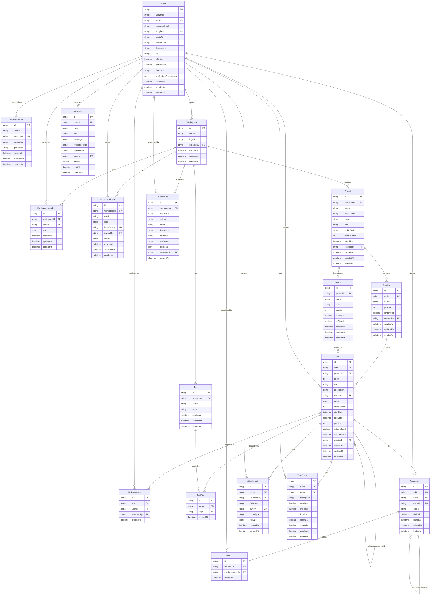

# FocusHub V1 - Database Schema & ERD

## Overview

This document defines the complete database schema for FocusHub V1. The database is **PostgreSQL** managed via **Prisma ORM** in a **NestJS** monorepo backend.

### Design Principles

- **UUIDs** as primary keys on all tables (`@id @default(uuid())`)
- **Soft delete** on all entities via `deletedAt DateTime?` (null = active)
- **Timestamps** (`createdAt`, `updatedAt`, `deletedAt`) on every model
- **Activity logging** — all mutations tracked in a central `ActivityLog` model with JSON snapshots of old/new values
- **Prisma naming** — PascalCase models, camelCase fields, mapped to snake_case tables/columns via `@@map` and `@map`
- **Gap-based positioning** — orderable entities use gaps (1000, 2000, 3000) to avoid mass updates on reorder
- **Validation** — Zod schemas for all DTOs (not class-validator)

### Prisma Conventions Used

| Concept | Prisma Convention |
|---------|------------------|
| Primary key | `id String @id @default(uuid())` |
| Foreign key | `@relation(fields: [...], references: [...])` |
| Unique constraint | `@@unique([fieldA, fieldB])` |
| Enum | `enum RoleName { OWNER MEMBER }` |
| Soft delete | `deletedAt DateTime?` filtered via Prisma middleware |
| Timestamps | `createdAt DateTime @default(now())` + `updatedAt DateTime @updatedAt` |
| Table mapping | `@@map("table_name")` |
| Column mapping | `@map("column_name")` |
| Index | `@@index([field1, field2])` |

---

## Entity Descriptions

---

### 1. `User`

The core user account. Stores profile info, auth method, and online status.

| Field | Prisma Type | Constraints | Description |
|-------|-------------|-------------|-------------|
| id | String | @id @default(uuid()) | Primary key |
| fullName | String | | User's display name |
| email | String | @unique | Login email |
| passwordHash | String? | | Null for Google OAuth users |
| googleId | String? | @unique | Google OAuth subject ID |
| avatarUrl | String? | | Profile picture URL (S3) |
| avatarColor | String | @default("#6366f1") | Hex color for initials avatar |
| designation | String? | | Job title |
| bio | String? | | Short bio |
| isOnline | Boolean | @default(false) | Updated via WebSocket connect/disconnect |
| lastSeenAt | DateTime? | | Last time user was active |
| timezone | String? | | e.g., 'Asia/Karachi' |
| notificationPreferences | Json | @default("{}") | Notification settings |
| createdAt | DateTime | @default(now()) | |
| updatedAt | DateTime | @updatedAt | |
| deletedAt | DateTime? | | Soft delete |

**Relations:** refreshTokens, workspacesCreated, workspaceMembers, workspaceInvitesSent, projectsCreated, taskListsCreated, tasksCreated, taskAssigneesAsUser, taskAssigneesAsAssigner, comments, mentionedIn, notifications, attachmentsUploaded, timeEntries, activityLogsPerformed

**Activity Log Tracking:** Log on `fullName`, `designation`, `bio`, `avatarUrl`, `avatarColor`, `timezone` changes.

**Maps to:** `@@map("users")`

---

### 2. `RefreshToken`

Stores hashed refresh tokens for JWT auth. One user can have multiple active sessions.

| Field | Prisma Type | Constraints | Description |
|-------|-------------|-------------|-------------|
| id | String | @id @default(uuid()) | |
| userId | String | FK -> User | Token owner |
| tokenHash | String | @unique | Hashed refresh token (never store raw) |
| deviceInfo | String? | | Browser/device identifier |
| ipAddress | String? | | IP at time of login |
| expiresAt | DateTime | | Token expiry (7 days) |
| isRevoked | Boolean | @default(false) | Manually revoked |
| createdAt | DateTime | @default(now()) | |

**Activity Log Tracking:** None — auth tokens are not user-facing activity.

**Maps to:** `@@map("refresh_tokens")`

---

### 3. `Workspace`

Top-level organizational container. A user can own/belong to multiple workspaces.

| Field | Prisma Type | Constraints | Description |
|-------|-------------|-------------|-------------|
| id | String | @id @default(uuid()) | |
| name | String | | Workspace name |
| logoUrl | String? | | Workspace logo (S3) |
| createdBy | String | FK -> User | Creator/owner |
| createdAt | DateTime | @default(now()) | |
| updatedAt | DateTime | @updatedAt | |
| deletedAt | DateTime? | | Soft delete |

**Relations:** creator, members, invites, projects, tags, activityLogs

**Activity Log Tracking:** Log on `name`, `logoUrl` changes. Log creation and deletion.

**Maps to:** `@@map("workspaces")`

---

### 4. `WorkspaceMember`

Junction: User <-> Workspace with role. A user can only be a member once per workspace.

| Field | Prisma Type | Constraints | Description |
|-------|-------------|-------------|-------------|
| id | String | @id @default(uuid()) | |
| workspaceId | String | FK -> Workspace | |
| userId | String | FK -> User | |
| role | Role | @default(MEMBER) | OWNER or MEMBER |
| createdAt | DateTime | @default(now()) | When joined |
| updatedAt | DateTime | @updatedAt | |
| deletedAt | DateTime? | | Soft delete (member removed — tasks keep "removed user" indicator) |

**Unique:** `@@unique([workspaceId, userId])`

**Activity Log Tracking:** Log member added, removed, role changed.

**Maps to:** `@@map("workspace_members")`

---

### 5. `WorkspaceInvite`

Pending email invitations. Token expires after 7 days.

| Field | Prisma Type | Constraints | Description |
|-------|-------------|-------------|-------------|
| id | String | @id @default(uuid()) | |
| workspaceId | String | FK -> Workspace | |
| email | String | | Invitee email |
| role | Role | @default(MEMBER) | Role to assign on accept |
| inviteToken | String | @unique | Secure random token |
| invitedBy | String | FK -> User | Who sent it |
| status | InviteStatus | @default(PENDING) | PENDING, ACCEPTED, EXPIRED, REVOKED |
| expiresAt | DateTime | | 7 days from creation |
| acceptedAt | DateTime? | | When accepted |
| createdAt | DateTime | @default(now()) | |

**Activity Log Tracking:** Log invite sent, accepted, revoked.

**Maps to:** `@@map("workspace_invites")`

---

### 6. `Project`

Projects (Spaces) live inside a workspace. Each project has its own statuses and task ID counter.

| Field | Prisma Type | Constraints | Description |
|-------|-------------|-------------|-------------|
| id | String | @id @default(uuid()) | |
| workspaceId | String | FK -> Workspace | Parent workspace |
| name | String | | Project name |
| description | String? | | |
| color | String | @default("#6366f1") | Hex color |
| icon | String? | | Icon identifier |
| taskIdPrefix | String | | e.g., 'FH', 'PROJ' |
| taskCounter | Int | @default(0) | Atomic counter for task IDs |
| isArchived | Boolean | @default(false) | Archive (reversible, separate from delete) |
| createdBy | String | FK -> User | |
| createdAt | DateTime | @default(now()) | |
| updatedAt | DateTime | @updatedAt | |
| deletedAt | DateTime? | | Soft delete — cascades to lists, tasks, statuses |

**Unique:** `@@unique([workspaceId, taskIdPrefix])`

**Activity Log Tracking:** Log on `name`, `description`, `color`, `icon`, `isArchived` changes. Log creation and deletion.

**Maps to:** `@@map("projects")`

---

### 7. `TaskList`

Lists live inside a project and contain tasks. Gap-based positioning (1000, 2000, 3000...).

| Field | Prisma Type | Constraints | Description |
|-------|-------------|-------------|-------------|
| id | String | @id @default(uuid()) | |
| projectId | String | FK -> Project | Parent project |
| name | String | | List name |
| position | Int | @default(1000) | Gap-based order within project |
| isArchived | Boolean | @default(false) | Archive status |
| createdBy | String | FK -> User | |
| createdAt | DateTime | @default(now()) | |
| updatedAt | DateTime | @updatedAt | |
| deletedAt | DateTime? | | Soft delete |

**Activity Log Tracking:** Log on `name`, `position`, `isArchived` changes. Log creation and deletion.

**Maps to:** `@@map("task_lists")`

---

### 8. `Status`

Custom statuses per project. 4 defaults created on project creation.

| Field | Prisma Type | Constraints | Description |
|-------|-------------|-------------|-------------|
| id | String | @id @default(uuid()) | |
| projectId | String | FK -> Project | Scoped to project |
| name | String | | Status name |
| color | String | @default("#94a3b8") | Hex color |
| position | Int | @default(1000) | Gap-based display order |
| isDefault | Boolean | @default(false) | System default (can't delete) |
| isClosed | Boolean | @default(false) | "Done" statuses for dashboard stats |
| createdAt | DateTime | @default(now()) | |
| updatedAt | DateTime | @updatedAt | |
| deletedAt | DateTime? | | Soft delete |

**Unique:** `@@unique([projectId, name])`

**Default statuses on project creation:**
1. To Do (position: 1000, isClosed: false)
2. In Progress (position: 2000, isClosed: false)
3. Review (position: 3000, isClosed: false)
4. Completed (position: 4000, isClosed: true)

**Activity Log Tracking:** Log creation, update, deletion, reorder.

**Maps to:** `@@map("statuses")`

---

### 9. `Tag`

Tags are workspace-scoped. Applied to tasks via TaskTag junction.

| Field | Prisma Type | Constraints | Description |
|-------|-------------|-------------|-------------|
| id | String | @id @default(uuid()) | |
| workspaceId | String | FK -> Workspace | Scoped to workspace |
| name | String | | e.g., 'Bug', 'Design', 'Backend' |
| color | String | @default("#6366f1") | Hex color |
| createdAt | DateTime | @default(now()) | |
| updatedAt | DateTime | @updatedAt | |
| deletedAt | DateTime? | | Soft delete |

**Unique:** `@@unique([workspaceId, name])`

**Activity Log Tracking:** Log creation, update, deletion.

**Maps to:** `@@map("tags")`

---

### 10. `Task`

Core entity. Self-referencing for subtasks (max depth 2). Gap-based positioning.

| Field | Prisma Type | Constraints | Description |
|-------|-------------|-------------|-------------|
| id | String | @id @default(uuid()) | |
| listId | String | FK -> TaskList | Parent list |
| parentId | String? | FK -> Task (self) | Null = top-level. Set = subtask |
| depth | Int | @default(0) | 0=task, 1=subtask, 2=sub-subtask. App + DB enforced max 2 |
| title | String | | Task title |
| description | String? | | Rich text description |
| statusId | String | FK -> Status | Current status |
| priority | Priority | @default(NONE) | URGENT, HIGH, NORMAL, LOW, NONE |
| taskNumber | Int | | Auto-generated from project.taskCounter |
| startDate | DateTime? | | |
| dueDate | DateTime? | | |
| position | Int | @default(1000) | Gap-based order within list/parent |
| isCompleted | Boolean | @default(false) | Quick flag |
| completedAt | DateTime? | | When marked complete |
| createdBy | String | FK -> User | |
| createdAt | DateTime | @default(now()) | |
| updatedAt | DateTime | @updatedAt | |
| deletedAt | DateTime? | | Soft delete — cascade to child subtasks |

**Display ID:** Computed at query time as `project.taskIdPrefix + '-' + taskNumber` (e.g., `FH-101`). Not stored.

**Subtask depth:** Enforced at app level (`depth = parent.depth + 1`, reject if > 2). No native CHECK in Prisma — enforced via Prisma middleware or service validation.

**Activity Log Tracking:** Log ALL field changes — `title`, `description`, `statusId`, `priority`, `startDate`, `dueDate`, `position`, `isCompleted`, `parentId`, `listId` (moves). Log creation, deletion.

**Maps to:** `@@map("tasks")`

---

### 11. `TaskAssignee`

Junction for multi-assignee. When member is removed from workspace, assignment stays with "removed user" indicator.

| Field | Prisma Type | Constraints | Description |
|-------|-------------|-------------|-------------|
| id | String | @id @default(uuid()) | |
| taskId | String | FK -> Task | |
| userId | String | FK -> User | Assigned user |
| assignedBy | String | FK -> User | Who assigned |
| createdAt | DateTime | @default(now()) | |

**Unique:** `@@unique([taskId, userId])`

**Activity Log Tracking:** Log assignee added, removed.

**Maps to:** `@@map("task_assignees")`

---

### 12. `TaskTag`

Junction: Task <-> Tag.

| Field | Prisma Type | Constraints | Description |
|-------|-------------|-------------|-------------|
| id | String | @id @default(uuid()) | |
| taskId | String | FK -> Task | |
| tagId | String | FK -> Tag | |
| createdAt | DateTime | @default(now()) | |

**Unique:** `@@unique([taskId, tagId])`

**Activity Log Tracking:** Log tag added/removed from task.

**Maps to:** `@@map("task_tags")`

---

### 13. `Comment`

Task comments with threading (replies via parentId). Parent deletion cascades to replies.

| Field | Prisma Type | Constraints | Description |
|-------|-------------|-------------|-------------|
| id | String | @id @default(uuid()) | |
| taskId | String | FK -> Task | Parent task |
| userId | String | FK -> User | Comment author |
| parentId | String? | FK -> Comment (self) | Null = top-level, set = reply |
| content | String | | Comment body |
| isEdited | Boolean | @default(false) | Edited flag |
| createdAt | DateTime | @default(now()) | |
| updatedAt | DateTime | @updatedAt | |
| deletedAt | DateTime? | | Soft delete — cascade to child replies |

**WebSocket events:** `comment:created`, `comment:updated`, `comment:deleted` broadcast to `task:<taskId>` room.

**Activity Log Tracking:** Log comment created, edited, deleted.

**Maps to:** `@@map("comments")`

---

### 14. `Mention`

Tracks @mentions in comments for notification targeting.

| Field | Prisma Type | Constraints | Description |
|-------|-------------|-------------|-------------|
| id | String | @id @default(uuid()) | |
| commentId | String | FK -> Comment | Source comment |
| mentionedUserId | String | FK -> User | Who was mentioned |
| createdAt | DateTime | @default(now()) | |

**Unique:** `@@unique([commentId, mentionedUserId])`

**Activity Log Tracking:** None — derived from comment content.

**Maps to:** `@@map("mentions")`

---

### 15. `Notification`

In-app notification center. Polymorphic reference. Auto soft-deleted after 90 days.

| Field | Prisma Type | Constraints | Description |
|-------|-------------|-------------|-------------|
| id | String | @id @default(uuid()) | |
| userId | String | FK -> User | Recipient |
| type | String | | 'task_assigned', 'comment_added', 'mentioned', 'due_date_near', 'status_changed', 'task_reassigned' |
| title | String | | Notification title |
| message | String? | | Notification body |
| referenceType | String | | Entity type: 'task', 'comment', 'project', 'workspace' |
| referenceId | String | | ID of the referenced entity |
| actorId | String? | FK -> User | Who triggered it |
| isRead | Boolean | @default(false) | |
| readAt | DateTime? | | |
| createdAt | DateTime | @default(now()) | |

**Cleanup:** Notifications older than 90 days are soft-deleted via a scheduled job/cron.

**Activity Log Tracking:** None — system-generated.

**Maps to:** `@@map("notifications")`

---

### 16. `Attachment`

File attachments on tasks. Stored in AWS S3, referenced by key. Presigned URL flow.

| Field | Prisma Type | Constraints | Description |
|-------|-------------|-------------|-------------|
| id | String | @id @default(uuid()) | |
| taskId | String | FK -> Task | Parent task |
| uploadedBy | String | FK -> User | |
| fileName | String | | Original filename |
| s3Key | String | @unique | S3 object key |
| mimeType | String | | e.g., 'image/png' |
| fileSize | BigInt | | Size in bytes |
| createdAt | DateTime | @default(now()) | |
| deletedAt | DateTime? | | Soft delete |

**Activity Log Tracking:** Log file uploaded, deleted.

**Maps to:** `@@map("attachments")`

---

### 17. `TimeEntry`

Manual time logging + timer-based tracking on tasks.

| Field | Prisma Type | Constraints | Description |
|-------|-------------|-------------|-------------|
| id | String | @id @default(uuid()) | |
| taskId | String | FK -> Task | |
| userId | String | FK -> User | Who logged time |
| description | String? | | What was worked on |
| startTime | DateTime | | Timer start or manual entry start |
| endTime | DateTime? | | Null = timer still running |
| duration | Int? | | Seconds (computed on stop, or manual entry) |
| isManual | Boolean | @default(false) | true = manual, false = timer |
| createdAt | DateTime | @default(now()) | |
| updatedAt | DateTime | @updatedAt | |
| deletedAt | DateTime? | | Soft delete |

**Activity Log Tracking:** Log created, updated, deleted.

**Maps to:** `@@map("time_entries")`

---

### 18. `ActivityLog`

Central audit trail. Append-only — no updates, no deletes.

| Field | Prisma Type | Constraints | Description |
|-------|-------------|-------------|-------------|
| id | String | @id @default(uuid()) | |
| workspaceId | String | FK -> Workspace | Scoped for querying |
| entityType | String | | 'task', 'project', 'comment', 'workspace', 'task_list', 'status', 'tag', 'attachment', 'time_entry' |
| entityId | String | | ID of affected entity |
| action | String | | 'created', 'updated', 'deleted', 'archived', 'assigned', 'unassigned', 'moved', 'status_changed', 'tag_added', 'tag_removed', 'file_uploaded', 'file_deleted' |
| fieldName | String? | | Specific field that changed (for updates) |
| oldValue | String? | | Previous value (stringified) |
| newValue | String? | | New value (stringified) |
| metadata | Json | @default("{}") | Denormalized context (e.g., task title, project name) |
| performedBy | String | FK -> User | Who did this |
| createdAt | DateTime | @default(now()) | |

**Indexes:**
- `@@index([entityType, entityId])` — entity history
- `@@index([workspaceId, createdAt])` — workspace activity feed
- `@@index([performedBy, createdAt])` — user activity feed

**Maps to:** `@@map("activity_logs")`

---

## Enums

```prisma
enum Role {
  OWNER
  MEMBER
}

enum InviteStatus {
  PENDING
  ACCEPTED
  EXPIRED
  REVOKED
}

enum Priority {
  URGENT
  HIGH
  NORMAL
  LOW
  NONE
}
```

---

## Activity Log Tracking Strategy

### How It Works

1. **Service-level pattern** — Each service method that mutates data calls `ActivityLogService.log()` after a successful Prisma operation.
2. **For updates** — capture `oldValue` and `newValue` per changed field. One activity log row per field changed (not per request). Enables granular filtering (e.g., "show all status changes").
3. **For creates/deletes** — `oldValue` or `newValue` is null respectively.
4. **Metadata JSON** — denormalized context for readable logs without joins (e.g., `{ "taskTitle": "Fix login bug", "projectName": "Backend" }`).
5. **workspaceId** — always populated, derived from entity's parent chain.
6. **Prisma middleware** — optionally intercept all `update`/`delete` operations to auto-log, reducing boilerplate.

### What Gets Logged

| Entity | Tracked Actions |
|--------|----------------|
| Workspace | created, updated (name, logo), deleted |
| WorkspaceMember | member_added, member_removed, role_changed |
| WorkspaceInvite | invite_sent, invite_accepted, invite_revoked |
| Project | created, updated (name, desc, color, icon), archived, deleted |
| TaskList | created, updated (name, position), archived, deleted |
| Status | created, updated, deleted, reordered |
| Tag | created, updated, deleted |
| Task | created, updated (all fields), deleted, moved (between lists) |
| Task (status) | status_changed (special action for dashboard/reporting) |
| TaskAssignee | assigned, unassigned |
| TaskTag | tag_added, tag_removed |
| Comment | created, edited, deleted |
| Attachment | file_uploaded, file_deleted |
| TimeEntry | created, updated, deleted |

### What Does NOT Get Logged

- Auth events (login, logout, token refresh) — security audit, not activity
- Notification reads — not user-facing activity
- Mention creation — derived from comments
- User profile changes — optional, not workspace-scoped

---

## Relationship Summary

| Relationship | Type | Description |
|---|---|---|
| User <-> Workspace | Many-to-Many | Via WorkspaceMember (with role) |
| Workspace -> Project | One-to-Many | Workspace contains projects |
| Project -> TaskList | One-to-Many | Project contains lists |
| Project -> Status | One-to-Many | Custom statuses per project |
| Workspace -> Tag | One-to-Many | Tags scoped to workspace |
| TaskList -> Task | One-to-Many | List contains tasks |
| Task -> Task | Self-referencing | parentId for subtasks (max depth 2) |
| Task <-> User | Many-to-Many | Via TaskAssignee (multi-assignee) |
| Task <-> Tag | Many-to-Many | Via TaskTag |
| Task -> Comment | One-to-Many | Task has comments |
| Comment -> Comment | Self-referencing | parentId for replies |
| Comment -> Mention | One-to-Many | Comment can mention users |
| Task -> Attachment | One-to-Many | Task has attachments |
| Task -> TimeEntry | One-to-Many | Task has time entries |
| User -> Notification | One-to-Many | User receives notifications |
| Workspace -> ActivityLog | One-to-Many | All activity scoped to workspace |
| User -> RefreshToken | One-to-Many | Multiple sessions per user |
| Workspace -> WorkspaceInvite | One-to-Many | Pending invites |

---

## ERD Diagram (Mermaid)



---

## Index Strategy

Key indexes beyond primary keys and foreign keys (defined via `@@index` in Prisma):

| Model | Index | Purpose |
|-------|-------|---------|
| User | `email` (unique) | Login lookup |
| User | `googleId` (unique, optional) | OAuth lookup |
| WorkspaceMember | `[workspaceId, userId]` (unique) | Prevent duplicates |
| WorkspaceInvite | `[workspaceId, email, status]` | Check existing invites |
| Project | `[workspaceId, taskIdPrefix]` (unique) | Unique prefixes |
| Status | `[projectId, position]` | Ordered status list |
| Task | `[listId, position]` | Ordered task list |
| Task | `[listId, parentId, position]` | Subtask ordering |
| Task | `[statusId]` | Board view grouping |
| Task | `[dueDate]` | Upcoming deadlines |
| TaskAssignee | `[taskId, userId]` (unique) | Prevent duplicates |
| TaskAssignee | `[userId]` | "My tasks" query |
| TaskTag | `[taskId, tagId]` (unique) | Prevent duplicates |
| Comment | `[taskId, createdAt]` | Chronological comments |
| Notification | `[userId, isRead, createdAt]` | Notification center |
| ActivityLog | `[entityType, entityId]` | Entity history |
| ActivityLog | `[workspaceId, createdAt]` | Workspace feed |
| ActivityLog | `[performedBy, createdAt]` | User activity feed |
| TimeEntry | `[taskId, userId]` | Time per task per user |

---

## Soft Delete Strategy (Prisma Middleware)

Since Prisma doesn't have built-in soft delete, we use **Prisma middleware** that:

1. **On delete** — intercepts `delete` and `deleteMany`, converts to `update` setting `deletedAt = new Date()`
2. **On find** — intercepts `findMany`, `findFirst`, `findUnique`, auto-adds `where: { deletedAt: null }` unless explicitly querying deleted records
3. **Cascade soft delete** — when a project is soft-deleted, a service-level method also soft-deletes all child task lists, tasks, statuses. Not middleware — explicit service logic for auditability.

---

## Notes

1. **Archive vs Soft Delete** — `isArchived` is a user-facing toggle (reversible). `deletedAt` is soft delete (hidden from queries). They are independent.

2. **Task ID Generation** — Use Prisma `$transaction` to atomically increment `project.taskCounter` and create the task with the new `taskNumber`. Prevents race conditions.

3. **Subtask Depth** — No native CHECK constraint in Prisma. Enforced at service level: `if (parent.depth >= 2) throw new UnprocessableEntityException('Max subtask depth exceeded')`.

4. **Default Statuses** — On project creation, within the same transaction, create 4 statuses: To Do (1000), In Progress (2000), Review (3000), Completed (4000, isClosed: true).

5. **WebSocket Events** — `isOnline` updated via WebSocket connect/disconnect. `lastSeenAt` updated on disconnect.

6. **Gap-Based Positioning** — New items get `position = lastPosition + 1000`. On reorder, compute midpoint between neighbors. If gap < 1, rebalance all positions in the list.

7. **Notification Cleanup** — Cron job runs daily, soft-deletes notifications where `createdAt < 90 days ago`.

8. **Removed Members** — When a WorkspaceMember is soft-deleted, their TaskAssignee records remain. Frontend checks if the assigned user's membership is active and shows "removed user" badge if not.
